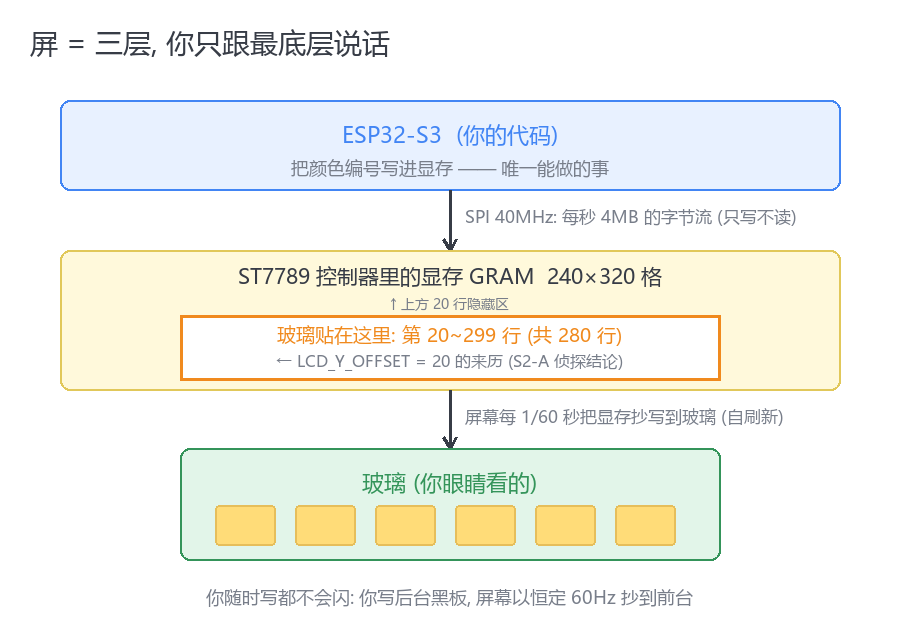
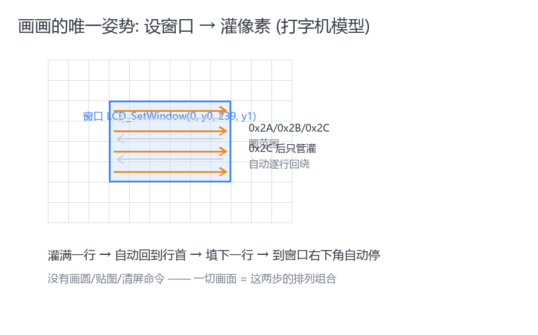
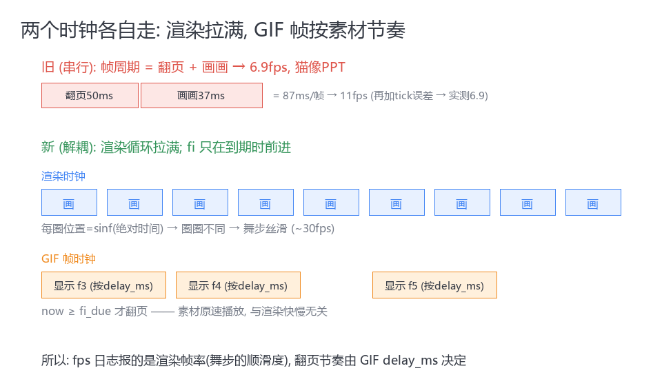
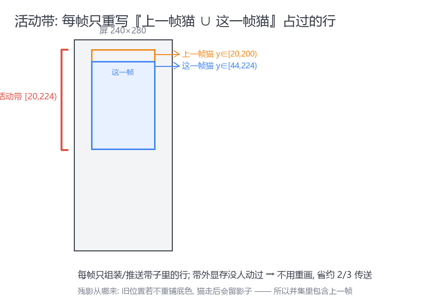
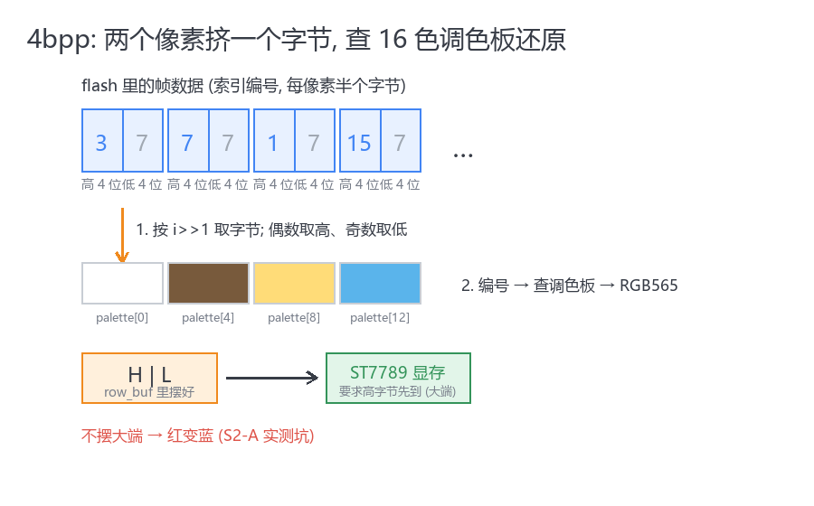
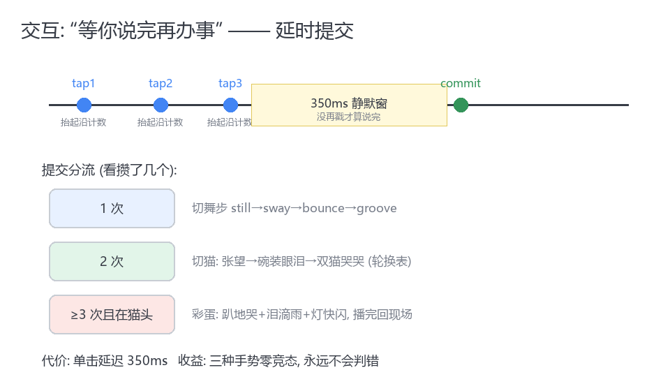
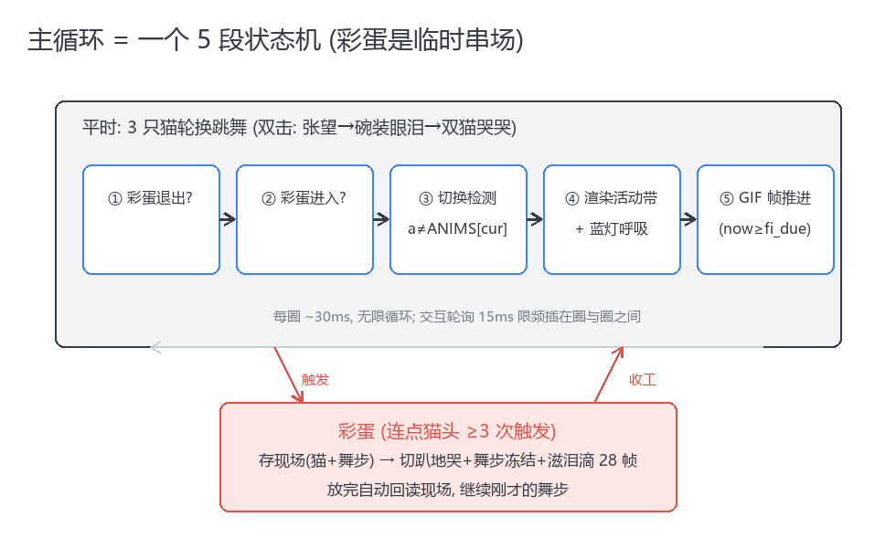

# 哭泣猫跳舞播放器 — cat_player.c 深度讲解

> 目标读者：刚跑通驱动、但看 `main/cat/cat_player.c` 一头雾水的自己。
> 第一部分用费曼法把"它到底在干嘛"讲成大白话；第二部分逐段拆代码，把每一行挂回原理。
> 兼作 S2-D 学习笔记 / 视频脚本底稿。

---

# 第一部分：费曼讲解（说人话版）

## 0. 先补一块地基：屏幕是个啥

一句话：**屏幕是一面墙的格子，每格存一个颜色编号；你能做的唯一操作 = 往格子里写编号。**

三个必须记住的事实（详细版见第二部分 §2）：

1. 你写的不是玻璃，是显存——屏幕自己每秒 60 次把显存抄到玻璃上，所以你随时写、慢慢写都不会闪；
2. 写的唯一姿势是**打字机模型**：先圈一个窗口（SetWindow），然后从左上角开始灌像素，灌满一行自动跳下一行；
3. 屏是"哑巴"：只收不发，发错它也照收（所以字节序错了它就把红显示成蓝）。

记住这三条，下面的代码没有任何一行超出这个模型。





## 1. 整个 cat_player.c 是一场提线木偶戏

想象一个操偶师（主循环）坐在幕布后，手里有这些东西：

| 代码里的东西 | 现实类比 | 它负责什么 |
|---|---|---|
| `cat_assets.c` 的帧数据 | 一叠画片 | 猫的每个姿势已经画好了 |
| `fi`（帧下标） | 翻画片的手 | 按素材节奏一页页翻 |
| `dance_offset()` | 提线的手 | 把整只猫**上下提、左右晃**——画片本身不动，动的是线 |
| 活动带 `y0..y1` | 黑板上擦写的区域 | 每次只擦猫占过的那几行，别的地方不碰 |
| `render_band()` | 画匠的手 | 把"底色+猫+眼泪"一行行拼好，推给屏 |
| `touch_poll()` | 门房的耳朵 | 听观众敲玻璃：敲 1 下换舞步，敲 2 下换猫，狂敲猫头它就哭给你看 |
| `led_beat()` | 脚灯 | 蓝光呼吸，猫弹得高灯就亮 |

**核心心法一句话：画片（GIF 帧）按素材自己的节奏翻，线（舞步位移）按时间连续地抖，两者互不等待。**



为什么这是关键？最初版本把"翻页 + 画一幅"串行做，一帧 = 50ms 翻页 + 37ms 画画 = 7fps，猫抖得像PPT。改成解耦后，操偶师每 30ms 就重画一遍（位置是正弦函数，每一遍都不一样，所以丝滑），翻页照旧 50ms 一页。**fps 从 6.9 到 36，一行算法没换，只换了节奏**——这是整个文件最重要的一条设计决策。

## 2. 五个容易卡住的点，用大白话过一遍

### ① "活动带"是什么？为什么不每帧刷全屏？

猫 220 高，屏 280 高。猫从第 30 行弹到第 44 行，只有这十几行像素变了——屏幕其他 240 行的显存**根本没人动过**，玻璃上自然还显示着。所以每帧只推"上一帧猫占的行 ∪ 这一帧猫占的行"这一条带子（`prev_y0..prev_y1 ∪ cy0..cy1`），带子外的显存保持原样。省 2/3 的传送时间。



### ② 逐行组装是什么意思？

DMA 一次只能搬一行（480 字节）。所以不是"先在内存里画好整幅图再推"，而是**流水线**：

```
对带内每一行 y：
  ① 整行先铺底色（240 个像素全填背景色字节）
  ② 如果这行穿过猫身 → 把猫的这一行像素"盖"上去
  ③ 把落在这一行上的泪滴粒子盖上去
  ④ 整行推给屏（DMA），马上去拼下一行
```

一行 240 像素在内存里就是 480 字节的 `row_buf`，拼一行推一行，内存占用只有 480B。

### ③ 猫的像素是怎么"盖"上去的？

素材是 4bpp 索引色：**每半字节是一个调色板编号**。一行 220 像素 = 110 字节。展开公式就三步：

```
第 i 个像素 → 第 (i>>1) 个字节       （两个像素挤一个字节）
i 是偶数取高 4 位，奇数取低 4 位      （高半字节在前）
编号查 palette 表得到 RGB565，拆成 [高字节,低字节] 摆进行缓冲（大端）
```



### ④ "延时提交"交互是什么？

人手一秒能戳三四下，程序怎么区分"单击""双击""连点猫头"？**等你说完再办事**：每次抬起手指后不立刻响应，安静等 350ms——

- 350ms 内没再戳 → 这就是单击 → 换舞步
- 戳了第 2 下 → 是双击 → 换猫
- 1.2 秒里戳满 3 下且都在猫脸上 → 生气了 → 彩蛋：切到趴地哭、滋泪滴、灯快闪，哭完一循环自动回原来的猫和舞步

代价是单击有 350ms 延迟，收益是三种手势永远不打架。



### ⑤ 彩蛋是个小状态机

```
平时: 在 3 只猫里轮换跳舞
      │ 连点猫头 (egg_req=true)
      ▼
存现场(当前猫+舞步) → 切到趴地哭 + 冻结舞步 + 滋泪滴 28 帧
      │ 28 帧放完 (egg_left==0)
      ▼
回读现场 → 继续刚才的舞步
```

泪滴是纯程序画的：12 颗小蓝点，从猫眼位置出生，每帧 `速度+重力` 落到猫底"泪池"消失。素材里没有这个效果——**可爱是程序加的，不是素材带的**。



---

# 第二部分：技术讲解（逐段拆代码）

对齐文件：`main/cat/cat_player.c`（约 300 行）。按"数据 → 小函数 → 主循环"的依赖顺序讲。

## 1. 素材格式：cat_anim_t 是什么

由 `tools/anim_gif2c.py` 生成，定义在 `cat_assets.h`：

```c
typedef struct {
    const char *name;
    uint16_t w, h, n_frames;
    uint16_t bg_color;            /* RGB565, 整屏底色 */
    const uint16_t *palette;      /* RGB565[16] */
    const uint8_t *const *idx;    /* 每帧一个 4bpp 数组, 高半字节在前 */
    const uint16_t *delay_ms;     /* 每帧延时 (还原 GIF 原节奏) */
} cat_anim_t;
```

要点：

- **4bpp 索引色**：每像素只存"调色板第几号"（半个字节），16 色调色板查表得真彩色。220×220 帧从 94KB 压到 24KB，4 段动画共 1.74MB，全放 flash（`const` → rodata 段，内存映射直接读，不占 RAM）。
- **bake 底色**：帧是**不透明**的，背景色直接烘进像素里（白猫白底/黑猫黑底）。没有透明掩码——最初版本做过"边缘洪泛抠底+1bpp 掩码"，验收图显示掩码从白猫细描边的缺口漏进猫身、整只猫被抠空，弃用。代价是设备端必须整屏同色打底，收益是省 25% 数据 + blit 不用判断透明。
- **`const uint8_t *const *idx`**：数组指针的数组。`a->idx[fi]` 取第 fi 帧的字节数组首址——因为每帧长度相同也可以用 `idx + fi*帧长` 的二维平铺，指针表方案生成代码更直观。

## 2. 依赖的地基：LCD 驱动提供的三个原语

cat_player 对屏的全部操作只有三个调用（都来自 S2-A 的裸驱动）：

| 原语 | 干什么 | 内部原理 |
|---|---|---|
| `LCD_SetWindow(x1,y1,x2,y2)` | 圈定显存写入范围 | 发 0x2A/0x2B/0x2C 三条命令；内部自动 `y+LCD_Y_OFFSET(20)` 补玻璃偏移 |
| `LCD_SendPixels(px, n)` | 推 n 个像素 | DMA 搬运，**阻塞**到发完；字节序要求大端，调用方自己摆 |
| `LCD_Init()` | 开机仪式 | SPI 40MHz + 复位 + SleepOut/MADCTL/COLMOD/Gamma/INVON |

没有画线、画圆、贴图 API——屏幕控制器只会"设窗口→灌像素"这一招，其余全是软件合成。

## 3. 文件级状态：7 个静态变量就是整台机器的旋钮

```c
static uint8_t *row_buf;      /* 480B DMA 行缓冲 (heap_caps_malloc, MALLOC_CAP_DMA) */
static uint16_t cur;          /* 当前动画下标 → ANIMS[] */
static dance_t  dance;        /* 舞步模式: STILL/SWAY/BOUNCE/GROOVE */
static bool     egg_req;      /* 连点猫头请求位 (touch_poll 置位, 主循环消费) */
static part_t   parts[12];    /* 泪滴粒子池 */
/* touch_poll 内部: press_start/was_down/p_cnt/p_head/p_deadline —— 边沿检测与计数 */
```

为什么是静态文件级而不是塞进结构体传参？单实例模块（屏只有一个），静态即全局语义清晰，还省掉上下文指针的传递噪音。

## 4. 运动层：dance_offset() 为什么用 sinf(t·ω)

```c
float t = esp_timer_get_time() * 1e-6f;   /* 绝对时间(秒), 不是帧计数 */
*dx = (int)(sinf(t * 5.2f) * 8);
```

两个关键选择：

1. **自变量是绝对时间**，不是"第几帧"。渲染快慢、卡顿都不影响猫的空间位置——位置是时间的确定函数，渲染循环任何时候来取都"接得上"。这就是渲染与帧率解耦能成立的前提。
2. **ω（角频率）每个舞步一个值**：sway 5.2 rad/s（≈0.83Hz 摇摆）、bounce 7.0（|sin| 取绝对值做弹跳——钟摆只取上半程就是弹跳轨迹）、groove 9.4。幅度是手调的像素值。

`led_beat()` 复用同一组 ω：灯的呼吸相位和猫的弹跳**同频同相**——`0.5+0.5*sinf(t*w)` 把 [-1,1] 抬到 [0,1] 当亮度。彩蛋时 ω=12 变快闪。

## 5. 渲染核心：render_band() 逐行流水线

```c
for (int y = y0; y <= y1; y++) {
    fill_row_bg(row_buf, bgH, bgL);              /* ① 铺底色 */
    if (y >= cy && y < cy + a->h) {              /* ② 该行穿过猫身 */
        const uint8_t *irow = ib + (size_t)(y - cy) * row_stride;
        for (int sx = sx0; sx < sx1; sx++) {
            int ix = sx - cx;
            uint8_t b = irow[ix >> 1];                       /* 两像素一字节 */
            uint16_t c = a->palette[(ix & 1) ? (b & 0xF) : (b >> 4)];
            row_buf[2*sx]   = c >> 8;             /* 大端: 高字节先 */
            row_buf[2*sx+1] = c & 0xFF;
        }
    }
    for (粒子池) if (落在第 y 行) 覆写 2 像素蓝色;  /* ③ 粒子最上层 */
    LCD_SendPixels((const uint16_t *)row_buf, LCD_W);  /* ④ DMA 推屏 */
}
```

细节账本：

- `row_stride = (w+1)/2`：奇数宽（碗装眼泪 w=175）也要凑整字节；
- `sx0/sx1`：舞步位移可能把猫推出屏边，水平裁剪防越界写；
- 调色板查表发生在**每像素**——16 项的表在 cache 里，无性能问题；若想优化可预展开成 65536 项直查（浪费，没必要）；
- 前提契约：调用前 `LCD_SetWindow` 必须已开到 `[y0..y1]`，因为 SendPixels 只管灌，控制器按窗口自动回绕。

每帧行数 ≈ 猫高+舞步幅度 ≈ 250 行 → 250×480B=120KB @40MHz≈24ms → 理论 ~40fps，实测 21-36fps（还有 I2C 轮询/日志/RMT 灯分走的时间）。

## 6. 交互：touch_poll() 的边沿检测与延时提交

```c
bool down = touch_read(&tx, &ty);       /* true=手指按着 (轮询, 非中断) */

if (down && !was_down)        press_start = now;            /* 按下沿 */
else if (!down && was_down)
    if (now - press_start < 400ms) { p_cnt++; p_head |= tap_on_head(tx,ty);
                                     p_deadline = now + 350ms; } /* 抬起沿→计1次 */

if (p_cnt && now > p_deadline) commit();     /* 350ms 静默 → 定案 */
```

设计要点：

- **按下沿记坐标**（`tap_on_head` 用当前动画实时矩形判定，舞步位移算在内），抬起沿判定短按（滤掉长按拖动）；
- `p_cnt` 封顶 3，`p_head` 累积"只要有一次点在猫头就算"；
- commit 分流：`≥3 && head → egg_req`；`≥2 → ROTATE[] 轮换`（趴地哭不在表里=彩蛋专属）；`=1 → dance++`；
- `egg_active` 期间 commit 全部丢弃——彩蛋不可打断，防状态机混乱；
- 轮询限频 15ms（时间阈值而非计数），I2C 100kHz 下每次读 5 字节≈0.5ms 总线占用，66Hz 轮询无压力。

## 7. 主循环：一个 5 段状态机 + 流水线

按执行顺序：

```c
while (1) {
    /* ① 彩蛋退出: egg_left 减到 0 → 回读 saved_cur/saved_dance */
    /* ② 彩蛋进入: egg_req 置位 → 存现场, cur=FLOORCRY, dance=STILL */
    /* ③ 切换检测: if (a != ANIMS[cur]) → fi=0, push_full_bg, 残影带复位
          ★ a 保持着"上一轮"的值, 所以能探测到本轮 cur 是否被改过 */
    /* ④ 渲染: cat_rect → 活动带并集 → SetWindow → render_band → led_beat */
    /* ⑤ GIF 帧推进: now >= fi_due 才 fi++, fi_due = now + delay_ms[fi]
          egg 时 egg_left-- 并按 fi%8 滋泪 */
    /* ⑥ 交互轮询 (15ms 限频) + vTaskDelay(1) 让出 CPU */
}
```

两个易错点（都是踩过的）：

1. **`a` 不能在循环顶重新赋值**。它必须保持上一轮值，③ 才能探测到变化。曾把 `a=ANIMS[cur]` 放循环顶，导致双击切换永远检测不到（铺底/重置全丢）。
2. **`egg_left` 按 GIF 帧计**，不按渲染循环计——渲染循环 30fps，GIF 才 10fps，按循环数彩蛋会缩短 3 倍。

帧推进的解耦数学：渲染循环每圈都跑（≥20fps），`fi` 只在 `now>=fi_due` 时前进——所以舞步以渲染帧率平滑，素材以原速播放，**两个时钟独立走**。

## 8. 复盘：五个设计决策与代价

| 决策 | 收益 | 代价/风险 |
|---|---|---|
| 逐行组装（不做全屏 framebuffer） | 0 大内存分配（134KB 帧缓冲免了）；复用 S2-A 验证过的 480B DMA 路径 | 每帧重复铺底色（CPU 可承受） |
| 4bpp+bake 底色（弃透明掩码） | 省 25% flash；blit 无透明判断；底色同色平移/旋转边缘隐形 | 不能叠在花底色上；依赖"整屏同底色"约定 |
| 渲染/GIF 帧解耦 | fps 6.9→36，舞步丝滑 | 两套时钟，egg 计数须按 GIF 帧 |
| 延时提交交互 | 三种手势零竞态 | 单击延迟 350ms（自媒体场景无感） |
| SPI 26→40MHz | 推屏 36→24ms | 排线信号完整性（花屏则回退） |

## 9. 自测题（费曼闭环）

1. 渲染循环和 GIF 帧推进解耦后，如果渲染突然卡了 200ms，猫的空间位置会错乱吗？为什么？
2. `render_band` 为什么敢假设"带外显存不需要重画"？哪一步操作违反了这个假设就会被肉眼看到？
3. 彩蛋期间用户狂点屏幕，为什么状态机不乱？（两个机制各挡住什么）
4. 如果素材换成"黑猫+白底"的 GIF，哪里会穿帮？管线要怎么改？

<details>
<summary>参考答案</summary>

1. 不会。位置是 `sinf(绝对时间)` 的函数，卡顿时时间照走，恢复渲染后猫直接出现在"此刻该在的位置"，最多丢中间轨迹（肉眼反而是瞬间跟上，无撕裂）。
2. 假设成立的前提是"带外像素上一帧和这一帧相同"。违反场景：切换动画时底色变了（白↔黑）——所以切猫必须 `push_full_bg` 全屏重铺，这就是那个函数存在的理由。
3. 机制一：`egg_active` 时 commit 全丢弃（外部输入进不来）；机制二：egg 入口/出口各自 `particles_kill_all()` + `fi=0` + 全屏铺底（内部状态归零）。
4. 猫身白色像素与白底同色，blit 后猫"消失"在底色里。管线需给这类素材配反差底色（如浅灰），或恢复掩码方案但改用"仅描边外洪泛+描边屏障"的健壮实现。
</details>
